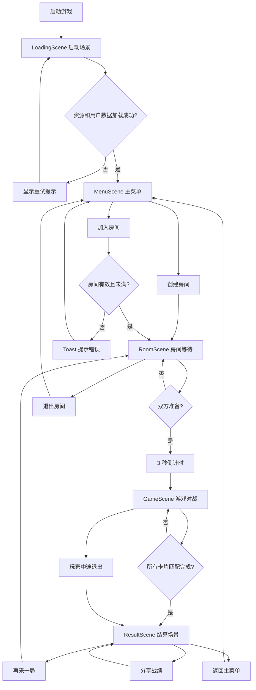

# 《翻翻对决》微信小游戏场景结构与 Canvas 布局设计

> 基于 Canvas 渲染的微信小游戏场景设计文档。  
> 目标：明确场景清单、UI 布局、切换流程、卡片网格自适应规则和不同屏幕适配方案。

---

## 1. 场景清单

### 1.1 启动场景 LoadingScene

职责：

- 初始化 Canvas、屏幕适配器、资源加载器。
- 初始化微信云开发。
- 预加载图片和音频资源。
- 读取本地用户配置。
- 获取或恢复用户登录状态。
- 加载完成后进入主菜单。

主要 UI：

- 游戏 Logo
- 加载进度条
- 加载百分比文字
- 简短状态提示，例如“正在加载资源”

### 1.2 主菜单 MenuScene

职责：

- 展示游戏入口。
- 显示用户基础信息和战绩概览。
- 提供创建房间、加入房间、排行榜、设置入口。

主要 UI：

- 游戏标题《翻翻对决》
- 玩家头像、昵称
- 胜场、总局数、胜率
- 创建房间按钮
- 加入房间按钮
- 排行榜按钮
- 设置按钮
- 背景粒子

### 1.3 房间等待 RoomScene

职责：

- 展示房间号和双方玩家信息。
- 房主选择难度。
- 双方准备。
- 邀请好友。
- 监听房间状态变化。
- 双方准备后倒计时并进入游戏。

主要 UI：

- 房间号
- 复制房间号按钮
- 邀请好友按钮
- 房主信息区
- 对手信息区
- 难度选择器
- 准备 / 取消准备按钮
- 退出房间按钮
- 开始倒计时遮罩

### 1.4 游戏对战 GameScene

职责：

- 渲染双方玩家信息、分数和当前回合。
- 渲染卡片网格。
- 处理翻牌输入。
- 执行匹配判定、计分、回合切换。
- 同步云端 `gameState`。
- 游戏结束后进入结算。

主要 UI：

- 顶部双方玩家栏
- 当前回合提示
- 30 秒倒计时
- 卡片网格
- 暂停 / 退出按钮
- 匹配成功粒子
- 失败抖动和翻回动画

### 1.5 结算场景 ResultScene

职责：

- 展示胜负结果。
- 展示双方分数和本局数据。
- 保存战绩。
- 提供再来一局、返回主菜单、分享战绩入口。

主要 UI：

- 胜利 / 失败 / 平局标题
- 双方分数对比
- 难度、用时、匹配对数
- 再来一局按钮
- 返回主菜单按钮
- 分享战绩按钮
- 胜利粒子或失败氛围效果

---

## 2. Canvas 全局布局模型

### 2.1 设计坐标系统

推荐以逻辑坐标进行布局，而不是直接使用设备像素。

```javascript
const systemInfo = wx.getSystemInfoSync()
const screenWidth = systemInfo.windowWidth
const screenHeight = systemInfo.windowHeight
const pixelRatio = systemInfo.pixelRatio || 1

canvas.width = screenWidth * pixelRatio
canvas.height = screenHeight * pixelRatio
ctx.scale(pixelRatio, pixelRatio)
```

后续所有布局坐标使用 `screenWidth` 和 `screenHeight` 这类逻辑像素。

### 2.2 安全区

```javascript
const safeArea = systemInfo.safeArea || {
  top: 0,
  left: 0,
  right: screenWidth,
  bottom: screenHeight,
  width: screenWidth,
  height: screenHeight
}

const safeTop = safeArea.top
const safeBottom = screenHeight - safeArea.bottom
const safeLeft = safeArea.left
const safeRight = screenWidth - safeArea.right
```

所有顶部 UI 应避开 `safeTop`，底部按钮应避开 `safeBottom`。

### 2.3 通用区域划分

```text
┌──────────────────────────┐
│ Safe Top / 状态栏避让区     │
├──────────────────────────┤
│ Header 顶部信息区          │
├──────────────────────────┤
│ Main 主内容区              │
│                          │
│                          │
├──────────────────────────┤
│ Footer 底部操作区          │
├──────────────────────────┤
│ Safe Bottom / 手势避让区    │
└──────────────────────────┘
```

推荐尺寸：

- 页面水平边距：`24`
- 小屏水平边距：`16`
- Header 高度：`72-96`
- Footer 高度：`88-120`
- 按钮高度：`48-56`
- 卡片最小点击尺寸：`44`

---

## 3. 各场景 Canvas 布局

以下布局以 `W = screenWidth`，`H = screenHeight` 表示。

### 3.1 启动场景布局

```text
┌──────────────────────────┐
│                          │
│                          │
│          Logo            │  y = H * 0.32
│       《翻翻对决》         │
│                          │
│     ┌──────────────┐     │
│     │  progress    │     │  y = H * 0.58
│     └──────────────┘     │
│        资源加载中 80%      │
│                          │
└──────────────────────────┘
```

元素位置：

- Logo 中心：`(W / 2, H * 0.30)`
- 标题中心：`(W / 2, H * 0.40)`
- 进度条：`x = W * 0.18`，`y = H * 0.58`，`width = W * 0.64`，`height = 12`
- 状态文字：`(W / 2, H * 0.64)`

渲染要点：

- 背景先绘制渐变或纯色。
- Logo 和标题可做轻微呼吸动画。
- 进度条使用圆角矩形，进度宽度随资源加载推进。
- 加载场景不需要复杂粒子，避免启动阶段消耗。

### 3.2 主菜单布局

```text
┌──────────────────────────┐
│ 设置                排行榜 │
│                          │
│        《翻翻对决》        │
│                          │
│   头像 昵称               │
│   胜场  胜率  总局数        │
│                          │
│      ┌────────────┐      │
│      │  创建房间   │      │
│      └────────────┘      │
│      ┌────────────┐      │
│      │  加入房间   │      │
│      └────────────┘      │
│      ┌────────────┐      │
│      │  单人练习   │      │
│      └────────────┘      │
│                          │
└──────────────────────────┘
```

元素位置：

- 设置按钮：`x = 24`，`y = safeTop + 16`
- 排行榜按钮：`x = W - 24 - buttonWidth`，`y = safeTop + 16`
- 标题中心：`(W / 2, safeTop + H * 0.16)`
- 用户信息区：`x = 24`，`y = safeTop + H * 0.26`，`width = W - 48`，`height = 92`
- 主按钮宽度：`min(W - 72, 280)`
- 主按钮高度：`52`
- 创建房间按钮：`centerY = H * 0.52`
- 加入房间按钮：`centerY = H * 0.62`
- 单人练习按钮：`centerY = H * 0.72`

渲染要点：

- 背景粒子放在背景层，数量控制在 20-30 个。
- 主按钮在 Canvas 中绘制为圆角矩形，保存 hit box 供输入系统检测。
- 用户信息区可用半透明背景，但不要遮挡主按钮。
- 小屏时标题上移，按钮间距从 `20` 缩小到 `14`。

### 3.3 房间等待布局

```text
┌──────────────────────────┐
│ 退出                      │
│       房间号 123456        │
│     复制      邀请好友      │
│                          │
│ ┌────────┐   ┌────────┐  │
│ │ 房主    │   │ 对手    │  │
│ │ 头像    │   │ 头像/等待│  │
│ │ 已准备  │   │ 未准备  │  │
│ └────────┘   └────────┘  │
│                          │
│       初级  中级  高级      │
│                          │
│      ┌────────────┐      │
│      │    准备     │      │
│      └────────────┘      │
└──────────────────────────┘
```

元素位置：

- 退出按钮：`x = 20`，`y = safeTop + 16`
- 房间号标题：`center = (W / 2, safeTop + 82)`
- 复制按钮：`x = W * 0.25 - 52`，`y = safeTop + 118`
- 邀请按钮：`x = W * 0.75 - 52`，`y = safeTop + 118`
- 玩家卡片区：
  - `cardWidth = (W - 64) / 2`
  - `cardHeight = 160`
  - 房主卡片：`x = 24`，`y = safeTop + 180`
  - 对手卡片：`x = 40 + cardWidth`，`y = safeTop + 180`
- 难度选择器：`x = 24`，`y = H - safeBottom - 190`，`width = W - 48`，`height = 48`
- 准备按钮：`x = 36`，`y = H - safeBottom - 112`，`width = W - 72`，`height = 56`

渲染要点：

- 房间号使用大字号，方便口述和截图。
- 难度选择器使用三段式 segmented control。
- 非房主看到难度选择器为只读状态。
- 对手未加入时显示“等待好友加入”。
- 双方准备后显示半透明倒计时遮罩：`3`、`2`、`1`。

### 3.4 游戏对战布局

```text
┌──────────────────────────┐
│ 头像A  分数A   VS   分数B 头像B │
│        当前回合 / 倒计时       │
├──────────────────────────┤
│                          │
│       卡片网格区域          │
│                          │
│                          │
│                          │
├──────────────────────────┤
│              退出          │
└──────────────────────────┘
```

区域划分：

- 顶部玩家栏：
  - `headerTop = safeTop + 8`
  - `headerHeight = 88`
- 回合提示：
  - `turnY = headerTop + 72`
- 卡片区域：
  - `gridTop = safeTop + 112`
  - `gridBottom = H - safeBottom - 72`
  - `gridHeight = gridBottom - gridTop`
  - `gridWidth = W - margin * 2`
- 底部退出按钮：
  - `x = W - 88`
  - `y = H - safeBottom - 56`
  - `width = 64`
  - `height = 40`

玩家栏元素：

- 左玩家头像：`x = 24`，`y = headerTop + 12`，`size = 44`
- 左玩家昵称：`x = 78`，`y = headerTop + 22`
- 左玩家分数：`x = 78`，`y = headerTop + 48`
- 右玩家头像：`x = W - 68`，`y = headerTop + 12`
- 右玩家昵称和分数右对齐
- 中间倒计时圆环：`center = (W / 2, headerTop + 36)`，`radius = 24`

渲染要点：

- 每帧先画背景，再画顶部信息，再画卡片，再画粒子和提示。
- 当前回合玩家的头像或分数区域加高亮描边。
- 倒计时低于 5 秒时变为警告色并轻微闪烁。
- 卡片动画期间当前卡片进入 `locked` 状态。
- 匹配失败回翻期间所有卡片输入锁定。

### 3.5 结算场景布局

```text
┌──────────────────────────┐
│                          │
│       胜利 / 失败 / 平局    │
│                          │
│     A 分数       B 分数     │
│                          │
│      难度 / 用时 / 配对数    │
│                          │
│      ┌────────────┐      │
│      │  再来一局   │      │
│      └────────────┘      │
│      ┌────────────┐      │
│      │  分享战绩   │      │
│      └────────────┘      │
│      ┌────────────┐      │
│      │  返回菜单   │      │
│      └────────────┘      │
└──────────────────────────┘
```

元素位置：

- 结果标题中心：`(W / 2, safeTop + H * 0.16)`
- 分数对比区：`x = 24`，`y = safeTop + H * 0.26`，`width = W - 48`，`height = 120`
- 本局数据区：`x = 24`，`y = safeTop + H * 0.43`，`width = W - 48`，`height = 72`
- 按钮宽度：`min(W - 72, 280)`
- 再来一局按钮：`centerY = H * 0.62`
- 分享战绩按钮：`centerY = H * 0.72`
- 返回菜单按钮：`centerY = H * 0.82`

渲染要点：

- 胜利时播放金币、星星、烟花粒子。
- 失败时减少粒子，保持清晰可读。
- 平局时使用中性色。
- 保存战绩过程显示 loading 状态，避免重复点击。

---

## 4. 场景切换流程图



---

## 5. 卡片网格自适应布局

### 5.1 通用计算公式

```javascript
function calculateGridLayout({
  screenWidth,
  screenHeight,
  safeTop,
  safeBottom,
  rows,
  cols
}) {
  const marginX = screenWidth <= 360 ? 14 : 20
  const headerHeight = 112 + safeTop
  const footerHeight = 68 + safeBottom

  const availableWidth = screenWidth - marginX * 2
  const availableHeight = screenHeight - headerHeight - footerHeight

  const gap = cols >= 6 ? 6 : 8
  const maxCardWidth = (availableWidth - gap * (cols - 1)) / cols
  const maxCardHeight = (availableHeight - gap * (rows - 1)) / rows

  const targetRatio = 1.25
  let cardWidth = Math.min(maxCardWidth, maxCardHeight / targetRatio)
  let cardHeight = cardWidth * targetRatio

  if (cardWidth < 44) {
    cardWidth = 44
    cardHeight = 55
  }

  const gridWidth = cardWidth * cols + gap * (cols - 1)
  const gridHeight = cardHeight * rows + gap * (rows - 1)

  return {
    cardWidth,
    cardHeight,
    gap,
    startX: (screenWidth - gridWidth) / 2,
    startY: headerHeight + (availableHeight - gridHeight) / 2,
    gridWidth,
    gridHeight
  }
}
```

### 5.2 初级 4x4

特点：

- 卡片最大，点击舒适。
- 适合新手和快速对战。
- 网格居中，保留较多视觉呼吸空间。

布局建议：

```text
cols = 4
rows = 4
gap = 8-10
cardWidth ≈ (W - 2 * margin - 3 * gap) / 4
cardHeight = cardWidth * 1.25
```

竖屏示意：

```text
┌────┬────┬────┬────┐
│    │    │    │    │
├────┼────┼────┼────┤
│    │    │    │    │
├────┼────┼────┼────┤
│    │    │    │    │
├────┼────┼────┼────┤
│    │    │    │    │
└────┴────┴────┴────┘
```

### 5.3 中级 4x6

需求指定为 `4x6`，推荐理解为 4 行 6 列，适合横向更多卡片但仍保持竖屏可用。

特点：

- 24 张卡片，12 对。
- 横向数量增加，卡片尺寸变小。
- 顶部 UI 要紧凑，给网格更多垂直空间。

布局建议：

```text
cols = 6
rows = 4
gap = 6-8
cardWidth ≈ (W - 2 * margin - 5 * gap) / 6
cardHeight = min(cardWidth * 1.25, availableHeight 限制)
```

竖屏示意：

```text
┌───┬───┬───┬───┬───┬───┐
│   │   │   │   │   │   │
├───┼───┼───┼───┼───┼───┤
│   │   │   │   │   │   │
├───┼───┼───┼───┼───┼───┤
│   │   │   │   │   │   │
├───┼───┼───┼───┼───┼───┤
│   │   │   │   │   │   │
└───┴───┴───┴───┴───┴───┘
```

如果某些窄屏设备上 6 列过小，可采用两种策略：

- 优先缩小间距和边距。
- 保持 6 列不变，允许卡片宽高比从 `1.25` 降到 `1.15`。

不建议把中级改成 `6 行 4 列`，因为需求已定义为 `4x6`，且横向布局更有辨识度。

### 5.4 高级 6x6

特点：

- 36 张卡片，18 对。
- 卡片最小。
- 需要严格保证点击区域。

布局建议：

```text
cols = 6
rows = 6
gap = 5-6
cardWidth = min(
  (availableWidth - 5 * gap) / 6,
  (availableHeight - 5 * gap) / 6 / 1.18
)
cardHeight = cardWidth * 1.18
```

竖屏示意：

```text
┌───┬───┬───┬───┬───┬───┐
│   │   │   │   │   │   │
├───┼───┼───┼───┼───┼───┤
│   │   │   │   │   │   │
├───┼───┼───┼───┼───┼───┤
│   │   │   │   │   │   │
├───┼───┼───┼───┼───┼───┤
│   │   │   │   │   │   │
├───┼───┼───┼───┼───┼───┤
│   │   │   │   │   │   │
├───┼───┼───┼───┼───┼───┤
│   │   │   │   │   │   │
└───┴───┴───┴───┴───┴───┘
```

高级难度渲染建议：

- 卡片圆角降低到 `6`。
- 阴影弱化或关闭。
- 粒子数量减少。
- 顶部玩家栏高度压缩到 `96-104`。
- 字体不随卡片缩小过度压缩，卡片内主要显示图片，不显示文字。

---

## 6. 屏幕适配方案

### 6.1 小屏设备

判断条件：

```javascript
const isSmallScreen = screenWidth <= 360 || screenHeight <= 640
```

调整：

- 页面边距从 `24` 降到 `16` 或 `14`。
- 主菜单按钮间距从 `20` 降到 `14`。
- 游戏顶部栏高度减少。
- 高级难度卡片间距降到 `5`。
- 减少背景粒子。
- 结算页按钮高度可从 `56` 降到 `48`。

### 6.2 高屏设备

判断条件：

```javascript
const isTallScreen = screenHeight / screenWidth > 2
```

调整：

- 不盲目拉伸卡片。
- 卡片网格仍居中。
- 顶部和底部留白可增加。
- 主菜单标题位置可略微下移，但按钮组保持在拇指舒适区域。

### 6.3 刘海屏和全面屏

处理：

- 所有顶部按钮从 `safeTop + 12` 开始。
- 底部按钮距离底边至少 `safeBottom + 16`。
- 不在安全区外放置可点击元素。

### 6.4 横屏

需求建议使用竖屏小游戏：

```json
{
  "deviceOrientation": "portrait"
}
```

如后续支持横屏，需要重做游戏对战布局：玩家信息放左右两侧，卡片网格居中。

### 6.5 Canvas 高清适配

必须处理 `pixelRatio`：

- Canvas 物理尺寸乘以 `pixelRatio`。
- `ctx.scale(pixelRatio, pixelRatio)`。
- 逻辑坐标仍使用窗口尺寸。
- 图片绘制时传逻辑宽高。

否则高分屏会出现文字和卡片模糊。

---

## 7. Canvas 渲染要点

### 7.1 渲染顺序

每帧推荐顺序：

```text
1. clearRect 清屏
2. 绘制背景层
3. 绘制背景粒子
4. 绘制场景主体
5. 绘制卡片和动画
6. 绘制前景粒子
7. 绘制 UI 层
8. 绘制遮罩、弹窗、Toast
```

### 7.2 文字绘制

要点：

- 设置 `textBaseline = 'middle'`，减少垂直对齐误差。
- 中文字体使用系统字体：`PingFang SC, Microsoft YaHei, sans-serif`。
- 重要数字，如房间号和倒计时，使用更高字重。
- Canvas 文本不会自动换行，长昵称要手动截断。

昵称截断：

```javascript
function ellipsisText(ctx, text, maxWidth) {
  if (ctx.measureText(text).width <= maxWidth) return text
  let result = text
  while (result.length > 0 && ctx.measureText(result + '...').width > maxWidth) {
    result = result.slice(0, -1)
  }
  return result + '...'
}
```

### 7.3 圆角矩形

按钮、卡片、信息面板都需要统一圆角绘制函数：

```javascript
function roundRect(ctx, x, y, width, height, radius) {
  const r = Math.min(radius, width / 2, height / 2)
  ctx.beginPath()
  ctx.moveTo(x + r, y)
  ctx.arcTo(x + width, y, x + width, y + height, r)
  ctx.arcTo(x + width, y + height, x, y + height, r)
  ctx.arcTo(x, y + height, x, y, r)
  ctx.arcTo(x, y, x + width, y, r)
  ctx.closePath()
}
```

### 7.4 图片加载与缓存

要点：

- 所有卡片图片在 LoadingScene 预加载。
- 使用资源管理器按路径缓存图片对象。
- 游戏中不要重复创建图片对象。
- 图片缺失时绘制占位卡片，避免白屏。

### 7.5 输入命中区域

Canvas 没有 DOM hit test，需要每个交互元素维护 hit box：

```javascript
{
  id: 'createRoom',
  x: 48,
  y: 420,
  width: 280,
  height: 56,
  disabled: false,
  onClick: () => {}
}
```

点击处理：

1. 将触摸坐标转换为 Canvas 逻辑坐标。
2. 先检测弹窗和遮罩。
3. 再检测按钮。
4. 最后检测卡片。
5. 如果场景锁定输入，直接忽略。

### 7.6 动画管理

所有动画统一由 `AnimationManager` 或场景的动画数组更新。

动画数据：

```javascript
{
  target,
  property: 'scaleX',
  from: 1,
  to: 0,
  duration: 300,
  elapsed: 0,
  easing: 'easeInOut'
}
```

渲染时不要用 `setInterval` 驱动画面，统一使用主循环的 `requestAnimationFrame`。

### 7.7 粒子性能

策略：

- 背景粒子低优先级。
- 匹配粒子短生命周期。
- 胜利粒子可分批生成。
- 粒子对象池复用，减少频繁创建对象。
- 低端机减少粒子数量和阴影。

### 7.8 脏矩形与离屏 Canvas

可优化项：

- 主菜单背景、房间面板等静态内容可预渲染到离屏 Canvas。
- 游戏中卡片和粒子变化较多，整屏重绘更简单可靠。
- 不建议初版过早实现复杂脏矩形，先保证结构清晰和帧率稳定。

### 7.9 状态与渲染分离

原则：

- 游戏状态只描述事实：谁的回合、哪些牌翻开、哪些已匹配。
- 渲染状态描述表现：翻转进度、抖动偏移、粒子位置。
- 云端只同步游戏状态，不同步粒子和本地动画细节。

这样可以避免网络同步和视觉动画互相污染。

---

## 8. 推荐布局常量

```javascript
export const LAYOUT = {
  pagePadding: 24,
  pagePaddingSmall: 16,
  headerHeight: 96,
  footerHeight: 88,
  buttonHeight: 52,
  buttonRadius: 10,
  panelRadius: 12,
  cardRadius: 8,
  minTouchSize: 44,
  gridGap: {
    EASY: 10,
    MEDIUM: 7,
    HARD: 5
  }
}
```

---

## 9. 实现建议

建议按以下顺序实现：

1. 先实现 `Adapter`，统一屏幕尺寸、像素比和安全区。
2. 实现基础 `SceneManager` 和 `Renderer`。
3. 用矩形占位完成五个场景的布局跳转。
4. 实现 `Button` hit test 和主菜单交互。
5. 实现 `CardGrid` 自适应布局。
6. 接入真实卡片图片。
7. 补翻牌动画、粒子和音效。
8. 最后接入云同步。

先把场景和网格布局跑通，再进入联网对战，会让调试过程清晰很多。

